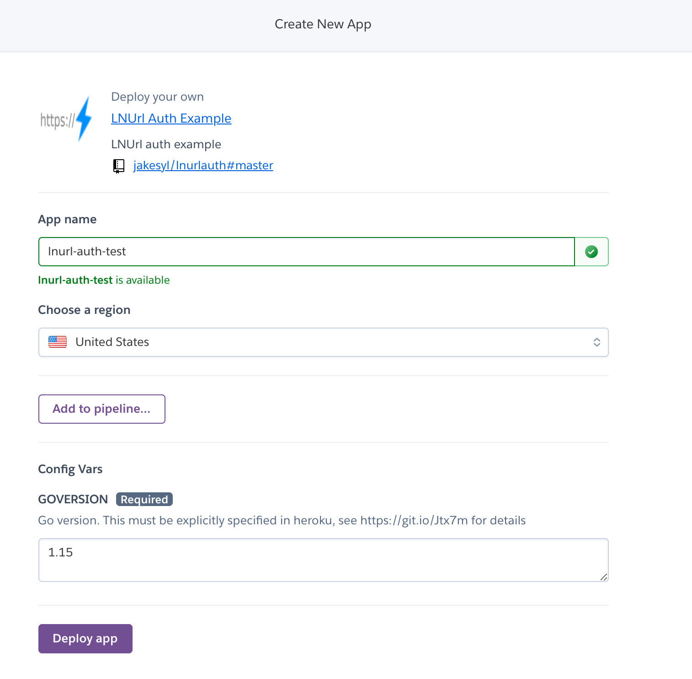
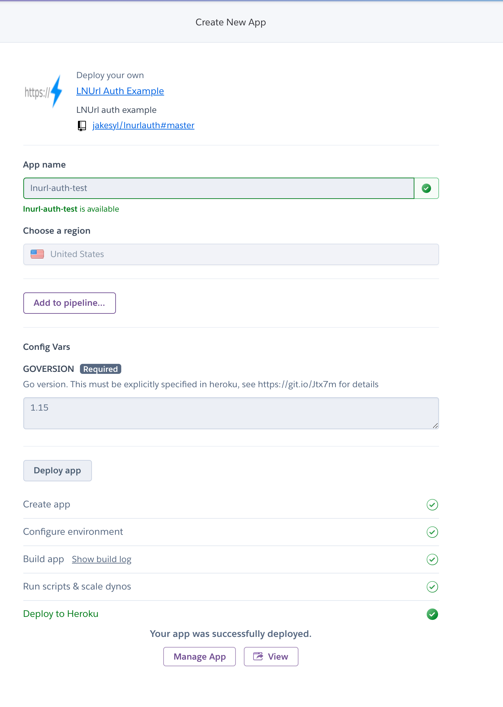
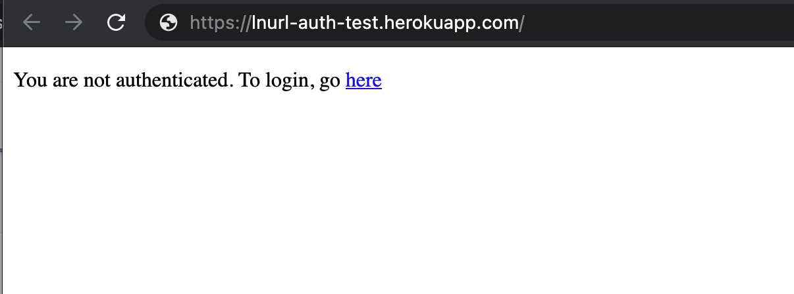

# LN Url

A golang lnurl example implementation by [entropy](https://entropy.rocks). This library is meant to demonstrate a service conforming to the [lnurl-auth](https://github.com/fiatjaf/lnurl-rfc/blob/master/lnurl-auth.md) standard and provide canonical ways of authenticating with lnurl auth. This library is based on [passport-ln-url-auth](https://github.com/chill117/passport-lnurl-auth) and utilizes [go-lnurl](https://github.com/fiatjaf/go-lnurl). You can see a live demo [here](https://lnurlauth.herokuapp.com/)

# Getting Started:

## Running Locally:

If you'd like to run this library locally, you can run `examples/main.go --help`. Alternatively, we provide docker and binary files [here](https://github.com/xplorfin/lnurlauth/releases). If you run with `--localtunnels=false` and your wallet is on another device, you will be unable to authenticate. We enable localtunnels by default

## Running on Heroku:

1. Click the deploy button below
 

2. Enter an available app name and hit deploy:

3. Wait for the deploy to finish

4. Visit your app

5. Now you should be able to authenticate using a lightning wallet such as [breez](https://breez.technology/):

